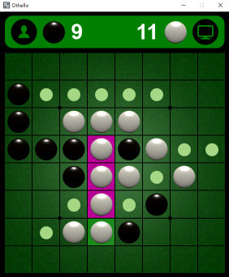

## Othello game with a GUI and AI opponent
### Description
My first Python project to play Othello with AI, the search algorithm is minimax with alpha beta pruning.
Notice, player may be no move to play(PASS), so we must check this situation!
```python
def __alphabeta(self, node, depth, alpha, beta, maximizingPlayer):
	if depth == 0 or self.__terminal(node):
            return self.__evaluation(node), None
        if maximizingPlayer:
	    # Check player PASS
            #max_player_moves = self.__get_legal_moves(node, self.__max_player)
            #if len(max_player_moves) == 0:
            #    return self.__alphabeta(node, depth-1, alpha, beta, not maximizingPlayer)
            value = -self.INFINITY
            best_move = None
            for move in max_player_moves:
                child_node, _ = self.__make_move(node, self.__max_player, move)
                max_temp, _ = self.__alphabeta(child_node, depth-1, alpha, beta, False)
                if max_temp > value:
                    value = max_temp
                    best_move = move
                alpha = max(alpha, value)
                if alpha >= beta:
                    break  # Beta cut off
            return value, best_move
        else:
	    # Check player PASS
            #min_player_moves = self.__get_legal_moves(node, self.__min_player)
            #if len(min_player_moves) == 0:
            #    return self.__alphabeta(node, depth-1, alpha, beta, not maximizingPlayer)
            value = +self.INFINITY
            best_move = None
            for move in min_player_moves:
                child_node, _ = self.__make_move(node, self.__min_player, move)
                min_temp, _ = self.__alphabeta(child_node, depth-1, alpha, beta, True)
                if min_temp < value:
                    value = min_temp
                    best_move = move
                beta = min(beta, value)
                if beta <= alpha:
                    break  # Alpha cut off
            return value, best_move
```
The evaluation function is simple, just a 2d array to score earch square.
```python
# Calculate the score of a giving position
SCORE_MATRIX = (( 99, -25, 10, 5, 5, 10, -25,  99,),
                (-25, -25,  1, 1, 1,  1, -25, -25,),
                ( 10,   1,  5, 2, 2,  5,   1,  10,),
                (  5,   1,  2, 1, 1,  2,   1,   5,),
                (  5,   1,  2, 1, 1,  2,   1,   5,),
                ( 10,   1,  5, 2, 2,  5,   1,  10,),
                (-25, -25,  1, 1, 1,  1, -25, -25,),
                ( 99, -25, 10, 5, 5, 10, -25,  99))
```
### Run the game
To start the game run `main.py`.
### Modules used
`Pygame` and `NumPy`
### Screen shot

